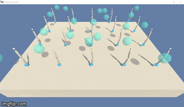
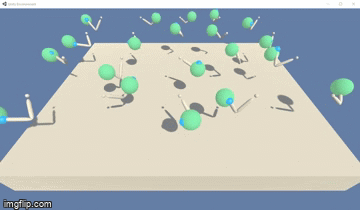

# Udacity Deep Reinforcement Learning Project 2: Continuous Control
Starter code and project details can be found [here](https://github.com/udacity/deep-reinforcement-learning/tree/master/p2_continuous-control).

## Environment and Untrained Agent
The goal of this project is to train an agent to solve the [Reacher](https://github.com/Unity-Technologies/ml-agents/blob/master/docs/Learning-Environment-Examples.md#reacher) environment.
Below is details about the environment and a video of 20 untrained agents acting in the environment.

    

**Reward:** of +0.1 is provided for each step that the agent's hand (blue orb) is in the goal location. The goal of your agent is to maintain its position at the rotating target location for as many time steps as possible.

**Observation Space:** consists of 33 continuous variables corresponding to position, rotation, velocity, and angular velocities of the arm and goal orb. 

**Action Space:** is a vector with four continuous numbers, corresponding to torque applicable to two joints. Every entry in the action vector should be a number between -1 and 1.

**Goal:** The task is episodic. In order to solve the environment the agents must get an average score of +30 over 100 consecutive episodes. Every Episode each agent will produce a score
and those 20 scores will be averaged to get a single episode score.
 
 
### Training the Agent: DDPG (Deep Deterministic Policy Gradients)
[Deep Deterministic Policy Gradients](https://arxiv.org/abs/1509.02971) is an actor-critic algorithm that is used to solve problems with
continuous actions spaces. More details can be read in the paper linked in the last sentence. The outline of the algorithm is below.

    

**Changes to Algorithm:**

 - To stabilize the algorithm, updates to the actor and critic network are made every `update_every` time steps in the environment. Currently set to 10 but can experiment with different values.
 - When the actor and critic networks are updated we do `num_updates` minibatch updates. Currently set to 10 but again you can experiement with different values.
 - Added an exploration parameter `Epsilon`. This allows us to scale down how often noise is added later in the simulation and therefore do less exploration during later episodes.

**Actor Network Architecture:**
  - Layer 1: Batch_Normalize Input_State (33) -> Fully_Connected (33, 256) -> Batch_Normalize Output_FC (256) -> Leaky_Relu (leak=0.01)
  - Layer 2: Fully_Connected (256, 128) -> Leaky_Relu (leak=0.01)
  - Layer 3: Fully_Connected (128, action_size 4) -> tanh (4)
  - Output: 4 actions between (-1,1) 

**Critic Network Architecture:**
  - Layer 1: Batch_Normalize Input_State (33) -> Fully_Connected (33, 256) -> Batch_Normalize Output_FC (256) -> Leaky_Relu (leak=0.01)
  - Layer 2: Concat (Layer_1_Output + action_size 4) -> Fully_Connected (260,128) -> Leaky_Relu (leak=0.01)
  - Layer 3: Fully_Connected (128, q_value 1)
   - Output: 1 Q_Value

**Hyperparameters:** 
 - Replay Buffer Size: 1,000,000
 - Batch Size: 128
 - Update Every: 10 (how often in timesteps to update networks)
 - Number of Updates: 10 (how many times to update per update_every)
 - Discount Rate Gamma: 0.99 (Q-Value Calculation)
 - Network Soft Update Rate Tau: 0.001
 - Learning Rate Actor: 0.0001
 - Learning Rate Critic: 0.001
 - Weight Decay: 0
 - Exploration Rate Epsilon: (start=1, decay=0.97, min=0.005)

**Results:**
Below is the results of training and a short video of the trained agents interacting in the environment. 
The agent solves the environment in approximately 115 episodes. The agents is also stable for the next 85 episodes.
If you spend more time tuning the hyperparameters and networks you can probably achieve even faster learning and better performance.

    

## Future Ideas
 - Tune the hyperparameters to solve the environment faster.
 - Solve the Crawler environment with the same Agent Architecture.
 - Attempt to solve both environments with the same Agent Architectures (not individually tuning hyperparameters).
 
