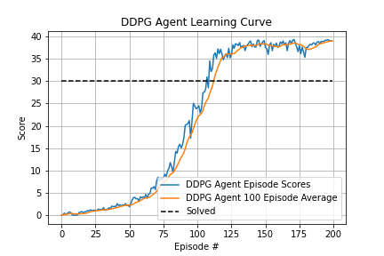

# Udacity Deep Reinforcement Learning Project 2: Continuous Control
Starter code and project details can be found [here](https://github.com/udacity/deep-reinforcement-learning/tree/master/p2_continuous-control).

## Environment and Untrained Agent
The goal of this project is to train an agent to solve the [Reacher](https://github.com/Unity-Technologies/ml-agents/blob/master/docs/Learning-Environment-Examples.md#reacher) environment.
Below is details about the environment and a video of 20 untrained agents acting in the environment.

<iframe width="360" height="210" style="position:absolute;top:0;left:0;width:100%;height:100%;" frameBorder="0" src="https://imgflip.com/embed/43v1v9"></iframe>

<a href="https://imgflip.com/gif/43v1v9">via Imgflip</a>

**Reward:** of +0.1 is provided for each step that the agent's hand (blue orb) is in the goal location. The goal of your agent is to maintain its position at the rotating target location for as many time steps as possible.

**Observation Space:** consists of 33 continuous variables corresponding to position, rotation, velocity, and angular velocities of the arm. 

**Action Space:** is a vector with four continuous numbers, corresponding to torque applicable to two joints. Every entry in the action vector should be a number between -1 and 1.

**Goal:** The task is episodic. In order to solve the environment your agent (or agents) must get an average score of +30 over 100 consecutive episodes.
 
 
### Training the Agent: DDPG (Deep Deterministic Policy Gradients)
[Deep Deterministic Policy Gradients](https://arxiv.org/abs/1509.02971) is an actor-critic algorithm that is used to solve problems with
continuous actions spaces. More details can be read in the paper linked in the last sentence. The outline of the algorithm is below.

    

**Changes:**

 - To stabilize the algorithm updates to the actor and critic network are made every `update_every` time steps in the environment. Currently set to 10 but can experiment with different values.
 - When the actor and critic networks are updated we do `num_updates` minibatch updates. Currently set to 10 but again you can experiement with different values.
 - Added an exploration parameter `Epislon`. This allows us to scale down the noise added later in simulation and therefore do less exploration later in the episode.

**Neural Network Architecture:**

**Hyperparameters:** 

**Results:**

## Comparisons
This section compares the currently implemented RL Agents.

## Future Ideas
